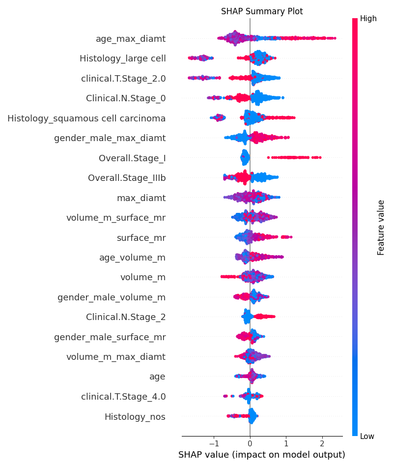
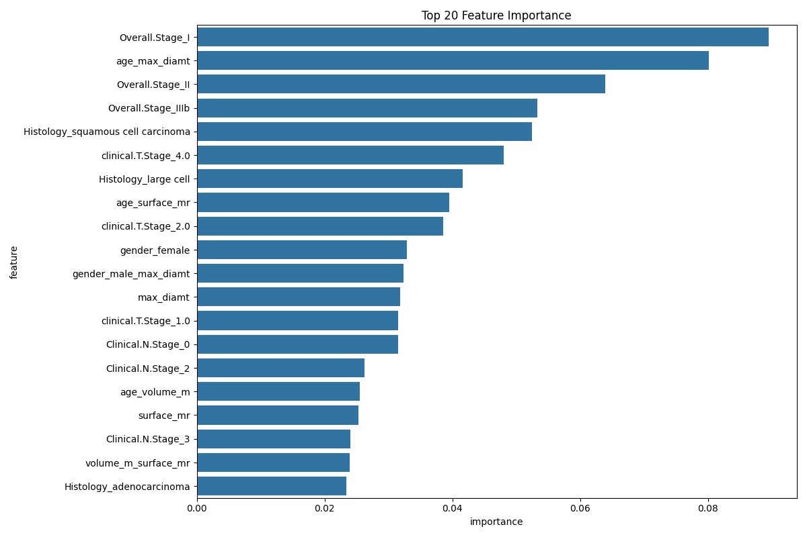

# P1: Machine Learning Analysis Pipeline

This section contains the machine learning analysis pipeline for processing and analyzing clinical and imaging data.

## File Structure

- `p1_1_preprocess_dataset1.py`: Preprocessing script for clinical data
- `p1_2_process_clinical_data.py`: Processing script for clinical data
- `p1_3_process_tumor_features.py`: Processing script for tumor features
- `p1_4_ML.py`: Main machine learning analysis script

## Data Processing Pipeline

### 1. Clinical Data Preprocessing (`p1_1_preprocess_dataset1.py`)
- Loads and preprocesses clinical data
- Handles missing values
- Standardizes continuous variables
- Performs one-hot encoding for categorical variables
- Output: `result1/p1_1_clinical1_processed.csv`

### 2. Clinical Data Processing (`p1_2_process_clinical_data.py`)
- Further processes the preprocessed clinical data
- Handles patient ID standardization
- Merges relevant clinical features
- Output: `result1/p1_2_cleaned_clinical_data.csv`

### 3. Tumor Features Processing (`p1_3_process_tumor_features.py`)
- Processes tumor imaging features
- Handles feature selection and standardization
- Output: `result1/p1_3_processed_tumor_features.csv`

### 4. Machine Learning Analysis (`p1_4_ML.py`)
Performs comprehensive machine learning analysis including:

#### Data Preparation
- Merges clinical and tumor features
- Handles missing values
- Creates interaction features
- Standardizes features

#### Analysis Components
1. **Single Modality Analysis**
   - Evaluates imaging features separately
   - Evaluates clinical features separately
   - Uses both XGBoost and Random Forest models
   - Performs cross-validation

2. **Multimodal Fusion Analysis**
   - Combines all features
   - Evaluates model performance
   - Handles class imbalance using SMOTE

3. **Feature Importance Analysis**
   - Calculates feature importance scores
   - Generates feature importance plots
   - Output: `result1/p1_4_feature_importance.png` and `result1/p1_4_feature_importance.csv`

4. **Model Interpretability Analysis**
   - Performs SHAP analysis
   - Generates SHAP summary plots
   - Output: `result1/p1_4_shap_summary.png` and `result1/p1_4_shap_values.csv`

5. **Model Comparison**
   - Compares XGBoost and Random Forest models
   - Generates model-specific SHAP plots
   - Output: `result1/p1_4_shap_summary_{model_name}.png` and `result1/p1_4_feature_importance_{model_name}.csv`

#### Final Output
- Comprehensive analysis results saved to `result1/p1_4_analysis_results.csv`

## Dependencies
- pandas
- numpy
- scikit-learn
- xgboost
- imbalanced-learn
- matplotlib
- seaborn
- shap

## Usage
1. Run the preprocessing scripts in order:
   ```bash
   python p1_1_preprocess_dataset1.py
   python p1_2_process_clinical_data.py
   python p1_3_process_tumor_features.py
   ```

2. Run the main analysis:
   ```bash
   python p1_4_ML.py
   ```

## Output Files
- `result1/p1_1_clinical1_processed.csv`: Preprocessed clinical data
- `result1/p1_2_cleaned_clinical_data.csv`: Processed clinical data
- `result1/p1_3_processed_tumor_features.csv`: Processed tumor features
- `result1/p1_4_feature_importance.png`: Feature importance plot
- `result1/p1_4_feature_importance.csv`: Feature importance data
- `result1/p1_4_shap_summary.png`: SHAP summary plot
- `result1/p1_4_shap_values.csv`: SHAP values data
- `result1/p1_4_analysis_results.csv`: Comprehensive analysis results

## Evaluation Metrics and Data Statistics

### Data Statistics
1. **Clinical Data**
   - Number of samples: 422
   - Number of features: 47 (original features)
   - Final number of features for modeling: 39 (including interaction features)
   - Class distribution:
     - deadstatus.event = 1: 88.39%
     - deadstatus.event = 0: 11.61%

2. **Tumor Features**
   - Number of imaging features: 3 (volume_m, surface_mr, max_diamt)
   - Feature interactions: 9 (including interactions with age and gender)
   - Missing value distribution: No missing values

### Evaluation Metrics
1. **Classification Metrics**
   - Accuracy: 0.842 ± 0.016 (XGBoost multimodal)
   - Precision: 0.951 ± 0.015 (XGBoost multimodal)
   - Recall: 0.721 ± 0.037 (XGBoost multimodal)
   - F1-score: 0.820 ± 0.023 (XGBoost multimodal)
   - AUC-ROC: 0.963 ± 0.007 (XGBoost multimodal)

2. **Feature Importance Metrics**
   - XGBoost feature importance scores:
     - Overall.Stage_I: 0.158
     - Overall.Stage_II: 0.063
     - age_max_diamt: 0.054
   - SHAP values:
     - age_max_diamt: 0.561
     - Histology_large cell: 0.435
     - clinical.T.Stage_2.0: 0.409

3. **Model Comparison Metrics**
   - XGBoost vs RandomForest:
     - XGBoost AUC: 0.963 ± 0.007
     - RandomForest AUC: 0.923 ± 0.017
   - Cross-validation scores:
     - 5-fold cross-validation
     - Standard deviation range: 0.007-0.037

4. **Multimodal Analysis Metrics**
   - Single modality performance:
     - Imaging features only (XGBoost): AUC = 0.776
     - Clinical features only (XGBoost): AUC = 0.960
   - Fusion model performance:
     - XGBoost: AUC = 0.963
     - RandomForest: AUC = 0.923

## Important Analysis Results

### 1. Model Performance Comparison

| Model Type | Accuracy | Precision | Recall | F1 Score | AUC |
|------------|----------|-----------|--------|----------|-----|
| Only Imaging Features (XGBoost) | 0.609 | 0.886 | 0.247 | 0.385 | 0.776 |
| Only Clinical Features (XGBoost) | 0.819 | 0.952 | 0.673 | 0.787 | 0.960 |
| Multimodal Fusion (XGBoost) | 0.842 | 0.951 | 0.721 | 0.820 | 0.963 |

### 2. Feature Importance Analysis

#### Most Important Features (Based on SHAP Values):

1. Age and Maximum Diameter Interaction Feature (0.561)
2. Large Cell Histological Type (0.435)
3. Clinical T2 Stage (0.409)
4. Clinical N0 Stage (0.324)
5. Squamous Cell Carcinoma Histological Type (0.302)

### 3. Visualization Results

#### SHAP Value Analysis


#### Feature Importance


## Main Findings

1. **Multimodal Fusion Advantage**:
   - The model combining clinical and imaging features performs the best
   - AUC improves to 0.963, a significant improvement over single modality

2. **Key Predictive Factors**:
   - The interaction term between age and imaging features is the most predictive
   - Histological type is an important predictive factor
   - Clinical stage (T stage and N stage) has a significant impact on prognosis

3. **Imaging Feature Contribution**:
   - Tumor Maximum Diameter
   - Surface Area
   - Volume
   These features, when combined with clinical information, provide a more accurate prediction. 