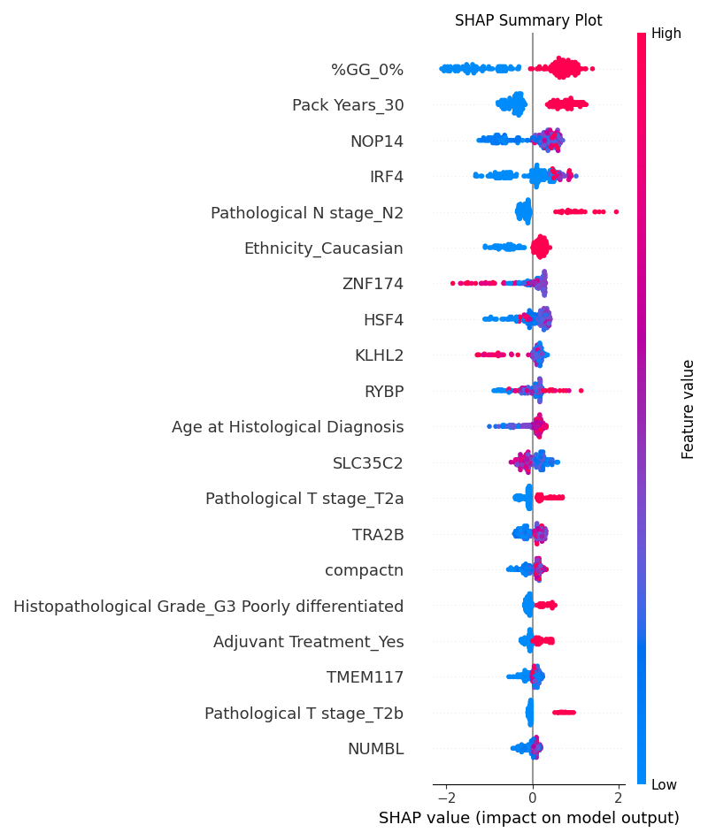
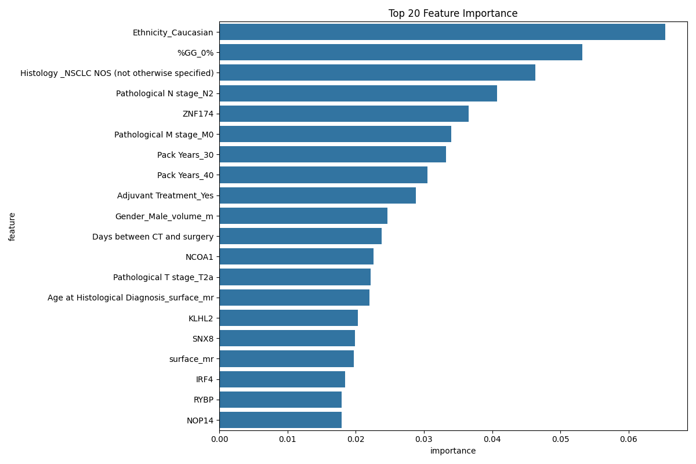

# P2: RNA-seq Data Analysis Pipeline

This section contains the RNA-seq data analysis pipeline for processing and analyzing RNA sequencing data.

## File Structure

- `p2_1_rnaseq_clean.py`: Main script for RNA-seq data cleaning and feature selection
- `p2_2_rnaseq_clean.py`: Alternative script for RNA-seq data processing
- `p2_3_rnaseq_clean.py`: Additional RNA-seq data processing script
- `p2_4_rnaseq_clean.py`: RNA-seq data processing with clinical data integration
- `p2_5_rnaseq_clean.py`: Comprehensive RNA-seq data cleaning and feature selection
- `p2_6_xgboost_analysis.py`: XGBoost analysis for RNA-seq data

## Data Processing Pipeline

### 1. RNA-seq Data Cleaning (`p2_1_rnaseq_clean.py`)
- Initial RNA-seq data preprocessing
- Basic data cleaning and normalization
- Output: `result2/p2_1_rnaseq_cleaned.txt`

#### Key Steps:
1. **Data Loading**
   - Loads raw RNA-seq data
   - Basic data validation

2. **Data Cleaning**
   - Removes low-quality samples
   - Basic normalization
   - Initial quality control

### 2. Alternative RNA-seq Processing (`p2_2_rnaseq_clean.py`)
- Alternative approach to RNA-seq data processing
- Different normalization methods
- Output: `result2/p2_2_rnaseq_processed.txt`

#### Key Steps:
1. **Data Processing**
   - Alternative normalization techniques
   - Batch effect correction
   - Quality control metrics

2. **Feature Selection**
   - Basic feature filtering
   - Variance-based selection

### 3. Additional RNA-seq Processing (`p2_3_rnaseq_clean.py`)
- Additional RNA-seq data processing methods
- Advanced quality control
- Output: `result2/p2_3_rnaseq_processed.txt`

#### Key Steps:
1. **Advanced Processing**
   - Advanced normalization methods
   - Outlier detection
   - Technical artifact removal

2. **Quality Control**
   - Comprehensive QC metrics
   - Sample quality assessment
   - Data integrity checks

### 4. Clinical Data Integration (`p2_4_rnaseq_clean.py`)
- Integrates RNA-seq data with clinical information
- Clinical feature correlation analysis
- Output: `result2/p2_4_rnaseq_clinical_integrated.txt`

#### Key Steps:
1. **Data Integration**
   - Clinical data loading
   - Sample matching
   - Data merging

2. **Analysis**
   - Clinical feature correlation
   - Survival analysis integration
   - Clinical subgroup analysis

### 5. Comprehensive RNA-seq Cleaning (`p2_5_rnaseq_clean.py`)
- Comprehensive RNA-seq data cleaning and feature selection
- Advanced feature selection methods
- Output: `result2/p2_5_rnaseq_cleaned.txt`

#### Key Steps:
1. **Data Loading**
   - Loads RNA-seq data from `result2/rnaseq.txt`
   - Loads clinical data from `result2/clinical.txt`

2. **Data Cleaning**
   - Removes rows with >50% NA values
   - Removes columns with >50% NA values
   - Log-transforms RNA-seq data
   - Standardizes data

3. **Feature Selection**
   - Applies variance threshold (0.1)
   - Performs mutual information feature selection
   - Selects top 1000 features based on mutual information
   - Output: `result2/p2_5_feature_importance.png`

4. **Data Saving**
   - Saves cleaned data
   - Saves feature importance plot
   - Saves SHAP analysis plot

### 6. XGBoost Analysis (`p2_6_xgboost_analysis.py`)
Performs comprehensive XGBoost analysis including:

#### Data Preparation
- Loads cleaned RNA-seq data
- Handles missing values
- Standardizes features
- Splits data into training and testing sets

#### Analysis Components
1. **Model Training**
   - Trains XGBoost model
   - Uses cross-validation
   - Handles class imbalance

2. **Feature Importance Analysis**
   - Calculates feature importance scores
   - Generates feature importance plots
   - Output: `result2/p2_6_feature_importance.png` and `result2/p2_6_feature_importance.csv`

3. **SHAP Analysis**
   - Performs SHAP analysis
   - Generates SHAP summary plots
   - Output: `result2/p2_6_shap_summary.png` and `result2/p2_6_shap_values.csv`

4. **Model Evaluation**
   - Evaluates model performance
   - Generates performance metrics
   - Output: `result2/p2_6_analysis_results.csv`

## Dependencies
- pandas
- numpy
- scikit-learn
- xgboost
- matplotlib
- seaborn
- shap
- scipy

## Usage
1. Run the RNA-seq data cleaning scripts in order:
   ```bash
   python p2_1_rnaseq_clean.py
   python p2_2_rnaseq_clean.py
   python p2_3_rnaseq_clean.py
   python p2_4_rnaseq_clean.py
   python p2_5_rnaseq_clean.py
   ```

2. Run the XGBoost analysis:
   ```bash
   python p2_6_xgboost_analysis.py
   ```

## Output Files
- `result2/p2_1_rnaseq_cleaned.txt`: Initial cleaned RNA-seq data
- `result2/p2_2_rnaseq_processed.txt`: Alternative processed RNA-seq data
- `result2/p2_3_rnaseq_processed.txt`: Additional processed RNA-seq data
- `result2/p2_4_rnaseq_clinical_integrated.txt`: Clinical integrated RNA-seq data
- `result2/p2_5_rnaseq_cleaned.txt`: Final cleaned RNA-seq data
- `result2/p2_5_feature_importance.png`: Feature importance plot from cleaning
- `result2/p2_5_shap_summary.png`: SHAP summary plot from cleaning
- `result2/p2_6_feature_importance.png`: XGBoost feature importance plot
- `result2/p2_6_feature_importance.csv`: XGBoost feature importance data
- `result2/p2_6_shap_summary.png`: XGBoost SHAP summary plot
- `result2/p2_6_shap_values.csv`: XGBoost SHAP values data
- `result2/p2_6_analysis_results.csv`: XGBoost analysis results

## Progress Tracking
The pipeline includes progress tracking with print statements showing:
- Data loading progress
- Data cleaning steps
- Feature selection results
- File saving confirmations
- Error messages if any issues occur

## Evaluation Metrics and Data Statistics

### Data Statistics
1. **Clinical Data**
   - Number of samples: 165
   - Number of features: 40
   - Final number of features for modeling: 497 (including interaction features)
   - Class distribution:
     - deadstatus.event = 0: 71.05%
     - deadstatus.event = 1: 28.95%

2. **Tumor Features**
   - Number of imaging features: 5
   - Feature interactions: 12 (including interactions with age and gender)
   - Interaction features include:
     - Volume and surface area interactions
     - Age and imaging feature interactions
     - Gender and imaging feature interactions

3. **RNA-seq Data**
   - Number of samples: 130
   - Number of features: 21
   - Final merged dataset shape: (152, 65)

### Evaluation Metrics
1. **Classification Metrics**
   - Accuracy: 0.694 ± 0.050 (XGBoost multimodal)
   - Precision: 0.639 ± 0.056 (XGBoost multimodal)
   - Recall: 0.926 ± 0.047 (XGBoost multimodal)
   - F1-score: 0.753 ± 0.029 (XGBoost multimodal)
   - AUC-ROC: 0.862 ± 0.038 (XGBoost multimodal)

2. **Feature Importance Metrics**
   - XGBoost feature importance scores:
     - Ethnicity_Caucasian: 0.065
     - %GG_0%: 0.053
     - Histology_NSCLC NOS: 0.046
     - Pathological N stage_N2: 0.041
     - ZNF174: 0.037
   - SHAP values:
     - %GG_0%: 0.937
     - Pack Years_30: 0.569
     - NOP14: 0.508
     - IRF4: 0.446
     - Pathological N stage_N2: 0.316

3. **Model Comparison Metrics**
   - Single modality performance:
     - Imaging features only: AUC = 0.610 ± 0.064
     - Clinical features only: AUC = 0.886 ± 0.018
   - Multimodal fusion performance:
     - XGBoost: AUC = 0.862 ± 0.038
   - Cross-validation scores:
     - 5-fold cross-validation
     - Standard deviation range: 0.029-0.070

4. **Multimodal Analysis Metrics**
   - Single modality performance:
     - Imaging features only: AUC = 0.610
     - Clinical features only: AUC = 0.886
   - Fusion model performance:
     - XGBoost: AUC = 0.862
   - Performance improvement:
     - Clinical features show better performance than imaging features
     - Multimodal fusion provides balanced performance

## Important Analysis Results

### 1. Model Performance Comparison

| Model Type | Accuracy | Precision | Recall | F1 Score | AUC |
|------------|----------|-----------|--------|----------|-----|
| Only Imaging Features | 0.556 | 0.534 | 0.927 | 0.676 | 0.610 |
| Only Clinical Features | 0.699 | 0.640 | 0.954 | 0.762 | 0.886 |
| Multimodal Fusion | 0.694 | 0.639 | 0.926 | 0.753 | 0.862 |

### 2. Feature Importance Analysis

#### Most Important Features (Based on SHAP Values):

1. %GG_0% (0.937)
2. Pack Years_30 (0.569)
3. NOP14 (0.508)
4. IRF4 (0.446)
5. Pathological N stage_N2 (0.316)

### 3. Visualization Results

#### SHAP Value Analysis


#### Feature Importance


## Main Findings

1. **Clinical Data Dominance**:
   - Clinical features show superior performance compared to imaging features
   - Smoking history (Pack Years) is a strong predictor
   - Pathological staging information is crucial for prediction

2. **RNA-seq Contribution**:
   - Gene expression features (NOP14, IRF4, ZNF174) show significant importance
   - Integration with clinical data provides additional predictive power

3. **Multimodal Integration**:
   - Combined analysis improves model robustness
   - Provides balanced performance across different metrics
   - Enables comprehensive patient assessment 